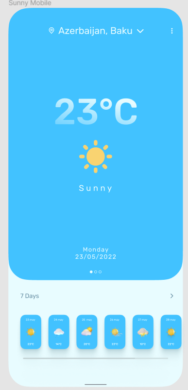
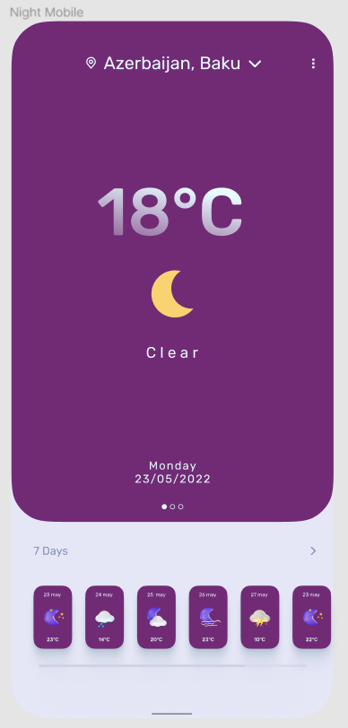
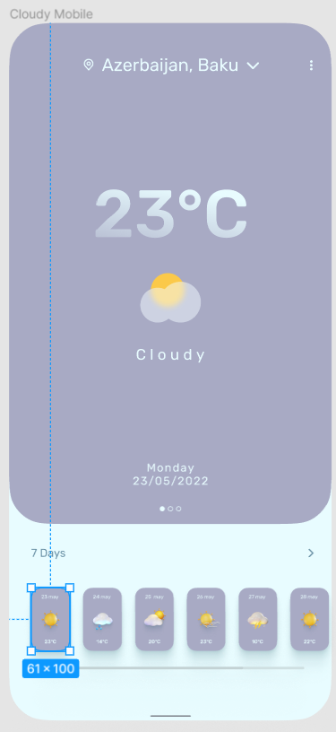
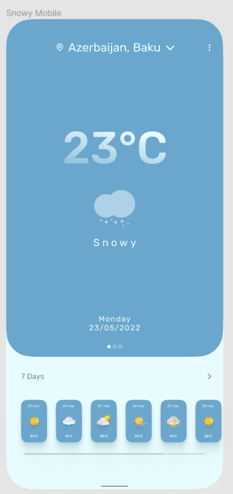

 

|          |             |                |
| :---:    |    :----:   |          :---: |
|  |  |  |
|  |

Weather app - це тестовий застунок для перегляду погоди,основною фічею застосунку є зміна ui в залежності від стану погоди та частини дня, його осоновна задача показати мої скіли :)

Дизайн був взятий з figma, якось хороша людина зробила його :)
Посилання - https://www.figma.com/file/LU3AhxekRAAkWq2EpCM5VG/Simple-Weather-(Community)?type=design&node-id=128-2&t=rT6uoVqvMcHXcIrR-0

### Основний стек:

- Kotlin
- XML Views
- ViewBinding
- [Koin](https://github.com/InsertKoinIO/koin)
- Coroutines
- Retrofit2
- OkHttp3

### Інші бібліотеки:

#### UI:
- UI states

#### Інше:
- [Easy permission](https://github.com/googlesamples/easypermissions)
- [Easy-checkout](https://github.com/alessandrojp/android-easy-checkout)
- Lifecycle
- LiveData
- Navigation component
- Android Jetpack

#### Архітектура:

- MVVM
- Clean Architecture
- MultiModule

##### Модулі:

+ app
    + Основний модуль додатка, що містить ui + di
+ domain
	+ Модуль, що містить бізнес-логіку та базові класи даних
+ data
	+ Модуль для доступу до даних (бази даних та API)

### Back-end:

Для Back-end  використовується Firebase, а саме:

##### 1. WeatherApi
Звідти береться вся основна інформація

